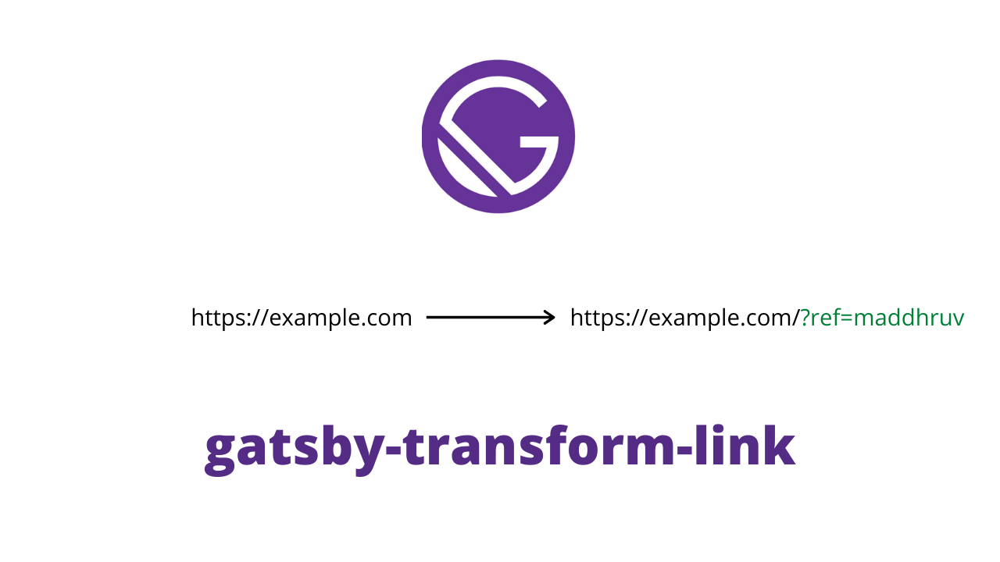

# gatsby-transform-link

Modifying links on bulk is now easier with `gatsby-transform-link`.



The plugin can add prefix and suffix to the absolute URLs in your gatsby content. Can be used for -

- adding UTM and Common Query Params
- adding keys in the start of links

## Install

`npm i gatsby-transformer-remark gatsby-transform-link`

## How to use

```js
// gatsby-config.js
plugins: [
  {
    resolve: `gatsby-transformer-remark`,
    options: {
      plugins: [
        {
          resolve: `gatsby-transform-link`,
          options: {
            prefix: "",
            suffix: "",
          },
        },
      ],
    },
  },
];
```

## Options

| Name     | Default | Description        |
| -------- | ------- | ------------------ |
| `prefix` | ''      | prefix to the URLs |
| `suffix` | ''      | suffix to the URLS |
